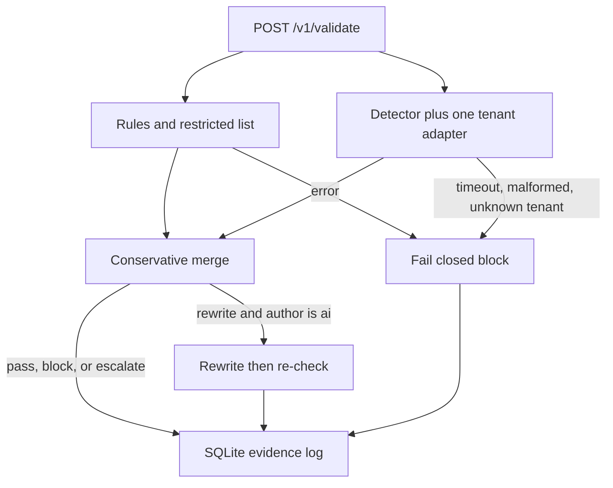

# Architecture

`POST /v1/validate` takes `body`, `rulepack`, `tenant_id`, and `author_type`. The only rulepack in this tree is `financial_services_client_communications`. `tenant_id` selects one pinned LoRA. An unknown tenant never falls through to another customer's adapter.

Merge order is block, then escalate, then rewrite, then pass. A human author never receives a rewrite; the verdict becomes block. An AI rewrite is detected again. If it still violates, the rewrite is discarded and the verdict is block, or escalate when the only remaining signal is a low-confidence model score.

The detector returns a short JSON object: violation, category, rule, policy match, span, confidence, explanation, suggested fix. vLLM is asked for that schema with temperature 0 and a 160-token cap. The rewrite is a second call, and only after a rewrite verdict.

Adapters are not stacked. Each tenant adapter is trained from the shared adapter and saved as one PEFT adapter on the frozen base, which is what vLLM can hot-swap. Rollback changes the `active` version in the registry.

`DETECTOR=mock` skips the network and applies the three written policies with regular expressions. `DETECTOR=vllm` sends `model` equal to the pinned module name (`northline-v0`, and `base-v0` for the shared adapter).
